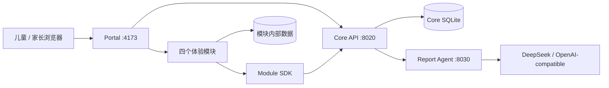

<div align="center">
  <h1>AI 伯乐 · 探索星球</h1>
  <p>以游戏化探索记录儿童行为线索的实验型多模块平台</p>
  <p><a href="#项目简介">项目简介</a> · <a href="#技术架构">技术架构</a> · <a href="#快速开始">快速开始</a> · <a href="#开发与验证">开发与验证</a> · <a href="#文档导航">文档导航</a></p>
</div>

## 项目简介

AI 伯乐是一个面向小规模教育实验的儿童探索平台。孩子从统一星球入口进入聊天观察、故事共创、深海基地重建和职业模拟器；系统记录可回溯的过程证据，整理作品、成长足迹和阶段性报告。

平台分为学生端与老师/家长端，两端共用统一账号、作品、点评和 V1 行为证据数据。

平台关注的是“孩子在具体任务中做了什么、如何尝试与调整”，不是用一次游戏决定天赋或职业。报告不输出能力分数、排名或诊断结论，所有观察都应回到原始行为证据，并由家长、教师结合长期、跨情境表现理解。

## 核心功能

- **统一入口与账号**：Portal 提供登录、模块目录、作品、成长足迹和报告入口。
- **四类探索体验**：聊天表达、故事创作、空间与生态任务、职业情境决策。
- **标准会话链路**：Portal 创建评估会话，以一次性 LaunchContext 启动模块；模块通过 SDK 换取短期授权并上报 V1 事件。
- **行为证据与作品**：Core 校验事件契约，保存标准证据、作品引用和会话状态。
- **成长足迹**：按模块聚合首次与最近完成时间、累计次数、累计时长和高光作品。
- **天赋地图与魔法书**：六星资格由 `/api/v1/talents` 从 strong 标准证据实时推导；行为回顾由 `/api/v1/evidence-records` 提供。
- **阶段性报告**：规则分析器始终可用；配置模型后可调用 OpenAI-compatible LLM，并通过同一输出契约归一化。
- **V1 唯一数据链路**：正式探索从 Portal 启动；会话、证据、作品、足迹与报告全部由 Core V1 管理。

## 技术架构



## 账号与双端视角

- 注册前先选择“我是学生”或“我是老师/家长”；登录入口同样按角色分开，避免进入错误视角。测试阶段的成人端不再细分家长与老师身份。
- 账号可以自行填写，也可以留空自动生成。自动编号使用 `S+年份+4位序号`（学生）或 `A+年份+4位序号`（成人），账号全局不可重复且登录时不区分大小写。
- 注册只需设置登录密码；忘记密码时输入用户名和新密码即可直接重置，测试阶段不再使用额外找回码。
- 老师/家长注册后仅凭学生账号即可绑定，不需要学生密码；每个成人账号最多绑定 5 位学生，并可通过顶部常驻的“管理学生”继续添加或解除绑定。首次绑定后界面会立即切换，无需刷新。
- 成人只能读取已绑定学生的报告、作品和足迹，不能代替学生生成作品或提交探索证据。

## 学生端与老师/家长端

- 学生端默认进入“探索星球”，只保留“探索星球”“我的作品”“天赋藏宝图”。
- “我的作品”收录四个模块的完成成果；学生也可自行选择所属大陆，添加作品名称和内容。自主添加的作品单独保存，不参与天赋证据判断。
- “天赋藏宝图”使用天赋报告现有的儿童地图视角；学生端不能切换到成人报告。
- 老师/家长端默认进入当前学生的“天赋报告”，并保留“作品展柜”和“成长足迹”。
- “作品展柜”只读展示学生全部作品；老师/家长可以发表评论，点评会同步显示在学生的“我的作品”中。
- “成长足迹”从成人观察视角展示学生注册起点、各模块首次/最近完成时间、累计次数与可用时长。

## 作品与成长数据

- 点击主星球附近的“我的作品”或“成长足迹”星石即可进入；顶部导航和浏览器前进、后退同样可用。
- 两个页面共用统一账号，并从 Core V1 的作品与时间线接口读取真实记录。
- 当前账号还没有探索记录，或后端暂时不可用时，页面会显示明确标注的示例内容，不会把示例当成孩子的真实档案。
- “我的作品”同时提供全部作品与四枚模块高光，保留详情阅读、中文朗读、字号切换和成人点评。
- “成长足迹”从账号注册日开始，按模块展示首次使用、最近使用、累计次数与可用的累计时长；仍包含星路手账、未点亮提示和作品互跳。
- 桌面、平板和手机布局均保留大点击区域、键盘焦点、减少动态偏好和清楚的加载/错误状态。

## 组件职责

| 组件 | 技术与职责 |
| --- | --- |
| Portal | React 19、TypeScript、Vinext；统一导航、启动上下文、作品、足迹与报告入口 |
| Core API | FastAPI、SQLite；账号、儿童档案、模块注册、会话授权、证据、作品、足迹与报告快照 |
| Module SDK | 原生 JavaScript；消费 `window.name` LaunchContext、兑换授权、事件与作品上报、会话完成或中断 |
| 聊天观察 | Node.js / Express；记录自由表达与对话观察 |
| 故事共创 | Vue 3 + FastAPI；故事生成、续写和作品保存 |
| 深海基地 | React + Flask；空间、生态和角色协作任务 |
| 职业模拟器 | FastAPI + 原生页面；职业情境决策与追问 |
| Report Agent | FastAPI；规则兜底、可选 LLM 分析和报告结构归一化 |

### 目录结构

```text
AI-platform-new/
├─ app/                         # Portal 页面、组件、hooks 与配置
├─ config/                      # 模块 Manifest 与 evidence policy
├─ docs/                        # 架构、实施状态、交接与行为埋点文档
├─ modules/
│  ├─ platform-core/            # 统一 Core API、数据库迁移与测试
│  ├─ report-agent/             # 报告生成与归一化
│  ├─ chat/                     # 聊天观察
│  ├─ story/                    # 故事共创（frontend/backend）
│  ├─ deep-sea/                 # 深海基地（frontend/server）
│  ├─ career/                   # 职业模拟器
│  └─ talent-report/            # 报告展示页面
├─ packages/                    # OpenAPI、JSON Schema 与 Module SDK
├─ scripts/                     # 服务注册和统一启动工具
├─ tests/                       # Portal、契约、启动与后端回归测试
├─ 安装全部依赖.ps1
├─ 一键启动.ps1
└─ README.md
```

## 快速开始

### 环境要求

- Windows 10/11 与 PowerShell 7
- Node.js `>= 22.13.0`
- Python `>= 3.8`（推荐 3.12）

### 1. 安装依赖

```powershell
.\安装全部依赖.ps1
```

脚本会安装根平台、四个体验模块和报告页面的 Node.js 依赖，并为五个 Python 服务创建各自的 `.venv`。

### 2. 配置模型

在项目根目录创建 `.env`：

```dotenv
DEEPSEEK_API_KEY=请填写自己的密钥
DEEPSEEK_BASE_URL=https://api.deepseek.com/v1
DEEPSEEK_MODEL=deepseek-chat
```

聊天、故事、职业、深海和报告服务统一读取根目录 `.env`。故事后端也兼容 `LLM_*` 变量名，但建议四个模块统一使用 `DEEPSEEK_*`。所有 `.env` 均被 Git 忽略；不要提交密钥、粘贴到前端代码或写入日志。

环境变量只在进程启动时读取。修改 key 后必须重启对应服务：

```powershell
.\一键启动.ps1 -Restart
```

### 3. 启动平台

```powershell
.\一键启动.ps1
```

脚本会构建 Portal，启动注册表中的 10 个本地服务，逐项等待健康检查通过，然后打开 <http://localhost:4173>。运行日志写入 `.runtime/logs/`。

```powershell
.\检查服务状态.ps1
.\停止全部服务.ps1
.\一键启动.ps1 -Restart -NoOpen
```

## 本地服务

| 端口 | 服务 | 入口 / 健康检查 |
| ---: | --- | --- |
| 4173 | Portal | `http://localhost:4173` |
| 8020 | Core API | `http://localhost:8020/api/health` |
| 8030 | Report Agent | `http://localhost:8030/health` |
| 3000 | 聊天观察 | `http://localhost:3000/chat.html?from=ai-bole` |
| 8010 / 5174 | 故事后端 / 前端 | `/api/health` / `/story-create?from=ai-bole` |
| 8005 / 3001 | 深海后端 / 前端 | `/api/health` / `/?from=ai-bole` |
| 8000 | 职业模拟器 | `http://127.0.0.1:8000/?from=ai-bole` |
| 5175 | 天赋报告页面 | `http://localhost:5175/?from=ai-bole` |

服务注册的唯一维护位置是 `scripts/服务配置.psd1`。新增或调整服务时，不要在多个启动脚本中重复硬编码端口。

## 开发与验证

```powershell
# Portal 构建、Node/契约/启动脚本测试、Core 与 Report Agent 测试
npm test

# 再验证各模块构建与聊天模块测试
npm run verify:workspace
```

重建仅用于开发的 Core 测试数据：

```powershell
.\modules\platform-core\.venv\Scripts\python.exe .\modules\platform-core\reset_dev_data.py --confirm
```

重置会先创建 SQLite 备份，再清空 Core 的测试账号、证据、作品、报告和快照；不会删除 `.env` 或模块内部数据库。不要提交 `modules/platform-core/data/` 下的数据库、WAL、SHM 或备份文件。

## 协作约定

- `packages/contracts` 是 API 与事件 Schema 的事实来源；修改生产接口时同步更新契约和测试。
- 新模块通过 Manifest 注册，不在 Portal 组件中增加固定模块 ID 或端口映射。
- Core 只保存跨模块标准数据；聊天全文、故事正文和职业内部明细继续由模块持有。
- 证据必须描述可观察行为，不将一次表现转换为稳定天赋、职业结论或心理诊断。
- 每个阶段使用中文 commit 简述；提交前确认 `.env`、数据库和运行日志未进入暂存区。

## 文档导航

| 文档 | 内容 |
| --- | --- |
| [文档总览](docs/README.md) | 新伙伴阅读顺序与全部文档入口 |
| [开发与交接指南](docs/development-and-handover.md) | 配置、数据流、模块接入、故障排查和发布检查 |
| [架构设计 v1.1](docs/superpowers/specs/2026-08-29-modular-assessment-platform-architecture-design.md) | 架构决策、数据模型、API 边界与迁移策略 |
| [重构实施状态](docs/modular-assessment-refactor-status.md) | 阶段 0–5 的交付状态与兼容边界 |
| [阶段 0 基线](docs/architecture/phase-0-baseline.md) | 重构前服务、数据与功能基线 |
| [行为证据埋点清单](docs/行为证据采集埋点清单.md) | 四模块事件、构念和强弱证据约定 |
| [OpenAPI](packages/contracts/openapi/core-api.v1.yaml) | Core V1 HTTP 接口契约 |

## 项目边界

本项目服务于几十名学生规模的实验验证，不以高并发、多租户或医疗级合规为目标。直接打开模块仍可体验，但不会写入 Core；只有从 Portal 进入的 V1 会话才会保存成长记录。
