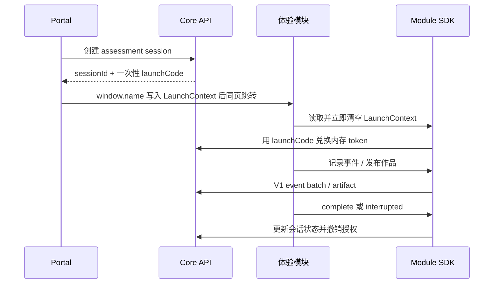

# AI 伯乐开发与交接指南

## 1. 系统边界

AI 伯乐由统一 Portal、Core API、Module SDK、四个体验模块、报告服务和报告展示页组成。系统按几十名学生的实验规模设计，使用本地多进程与 SQLite，不引入消息队列、OAuth/JWT 或微服务治理平台。

跨模块数据由 Core 管理：账号、儿童档案、评估会话、短期授权、标准事件、证据记录、作品索引、足迹和报告快照。模块内部内容仍留在模块内，例如聊天全文、故事正文、深海运行状态和职业任务细节；Core 通过 `sessionId`、`sourceResourceId` 和 artifact 建立正式关联。

## 2. 一次探索的生产数据流



直接打开模块、没有 LaunchContext 时，模块保留自身体验能力，但不得创建 V1 会话、上报证据或发布作品；页面应提示从探索星球进入后才会保存成长记录。

## 3. 配置与密钥

根目录 `.env` 使用 `DEEPSEEK_API_KEY`、`DEEPSEEK_BASE_URL` 和 `DEEPSEEK_MODEL`。chat、career、deep-sea 和 report-agent 读取该文件；报告服务可用 `REPORT_LLM_*` 覆盖通用配置。story backend 目前读取 `modules/story/backend/.env`，支持 `DEEPSEEK_*` 与 `LLM_*` 两组名称。

`.env` 只在进程启动时读取。换 key 后运行 `.\一键启动.ps1 -Restart`，仅刷新浏览器不会改变旧进程中的配置。不得提交 `.env`，也不要在日志、issue 或测试快照中打印密钥。

## 4. 本地开发流程

```powershell
.\安装全部依赖.ps1
.\一键启动.ps1
.\检查服务状态.ps1
npm test
npm run verify:workspace
```

修改单个模块时可以单独启动它，但最终必须再从 Portal 入口走一次 LaunchContext 生产路径。浏览器直开模块只能证明模块自身可用，不能证明 V1 会话、授权、事件和作品链路可用。

## 5. 模块接入约定

1. 在 `config/modules/` 增加符合 Manifest Schema 的配置。
2. 在 `packages/contracts/schemas/evidence/` 定义事件 payload Schema，并更新 evidence policy。
3. 模块加载公共 SDK，消费一次性 LaunchContext；token 只保存在内存。
4. 上报 Manifest 声明的事件；正常结束完成会话，离开或异常结束标记 interrupted。
5. 如产出可展示内容，发布 artifact，并保留稳定 `sourceResourceId`。
6. 增加入口、事件、artifact、状态转换与返回 Portal 的契约测试。

Portal 的模块目录以 `/api/v1/modules` 为权威来源。不要在页面组件中新增固定模块数组、ID 映射或端口常量。

## 6. 报告链路

Core 只以标准 V1 evidence records 作为报告输入。报告快照记录证据集合哈希和 evidence links，保证结果可以追溯。

Report Agent 未配置模型或请求失败时使用 `RuleAnalyzer`；配置模型后，LLM 必须返回 `dimensions[]`、`cross_insights[]`、`evidence_explanations[]` 和嵌套的 `recommendations.family/teacher`。`normalize_report` 会过滤伪造引用并为缺失部分使用规则结果。

修改提示词或字段时，必须同步修改归一化器、Core 报告契约和 `modules/report-agent/tests/`。如果页面看起来始终是规则报告，先确认 8030 进程是否在修改配置后重启，再检查模型返回结构。

## 7. 数据库与迁移

```powershell
Push-Location modules\platform-core
.\.venv\Scripts\python.exe .\migrate.py --dry-run
.\.venv\Scripts\python.exe .\migrate.py
Pop-Location
```

当前不迁移 V0 测试数据。使用 `reset_dev_data.py --confirm` 会先创建 Online Backup，再重建纯 V1 Core 数据库；旧表存在时 Core 会拒绝启动，避免双轨数据被误用。

不要提交数据库、`-wal`、`-shm`、备份或真实学生导出。排障前先复制数据库，不要用破坏性 Git 操作覆盖用户数据。

## 8. 测试门禁

| 改动 | 最低验证 |
| --- | --- |
| Portal 页面或 hooks | `npm test` |
| Core API、Schema、数据库 | `npm test` + `migrate.py --dry-run` |
| 单个模块 | 对应模块测试/构建 + Portal 最短 E2E |
| SDK / LaunchContext | LaunchContext 与四入口契约测试 |
| Report Agent | `modules/report-agent/tests/` + 一份 evidence refs 报告回溯 |
| 发布候选 | `npm run verify:workspace` + 四模块人工最短路径 + 退出重登验证 |

批量事件端点是整批原子语义：任一事件非法时整批回滚。测试应覆盖 scope 拒绝、跨会话 token、非法状态转换、重复完成幂等、artifact 归属和 Schema 校验。

## 9. 常见故障

### 模型返回兜底文案或 500

1. 确认 key 写在该服务实际读取的 `.env`。
2. 运行 `.\一键启动.ps1 -Restart`，不要只刷新页面。
3. 查看 `.runtime/logs/` 中对应服务日志，但不要输出密钥。
4. 使用隔离请求确认上游 key、base URL 和 model 名称有效。
5. 报告服务还需检查 LLM JSON 是否符合嵌套报告契约。

### Portal 出现示例作品或足迹缺项

检查 Core 的 `/api/v1/artifacts` 与 `/api/v1/timeline`。页面只使用 V1 正式数据；示例数据必须有明确标识，不能被真实数据或网络故障混淆。

### 启动脚本报告端口冲突

先运行 `.\检查服务状态.ps1`。确认是本项目遗留进程后使用 `.\一键启动.ps1 -Restart`；脚本只回收服务注册表声明的端口。

## 10. 发布与交接清单

- [ ] `git status` 中没有 `.env`、数据库、WAL/SHM、日志或学生数据。
- [ ] 契约、实现、测试和文档已同步。
- [ ] `npm test` 与 `npm run verify:workspace` 通过。
- [ ] migration dry-run、备份路径和回滚副本已确认。
- [ ] 四模块均从 Portal 启动，事件、作品、完成/中断和返回路径正常。
- [ ] 报告能追溯到标准证据，模型失败时规则兜底正常。
- [ ] 修改 key 或配置后已重启相关进程。
- [ ] 中文 commit 说明改动目的与阶段，未夹带用户数据库变更。

## 11. 当前兼容边界

阶段 0–5 的架构交付已完成，V0 端点、旧桥接与历史回填不再保留。所有正式数据必须通过 Portal → LaunchContext → SDK → V1 API 写入。
