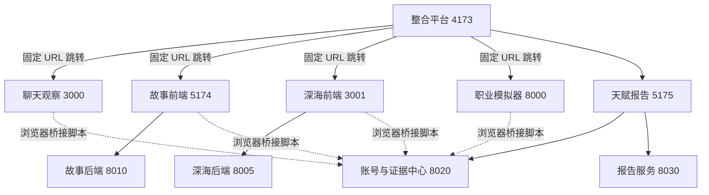
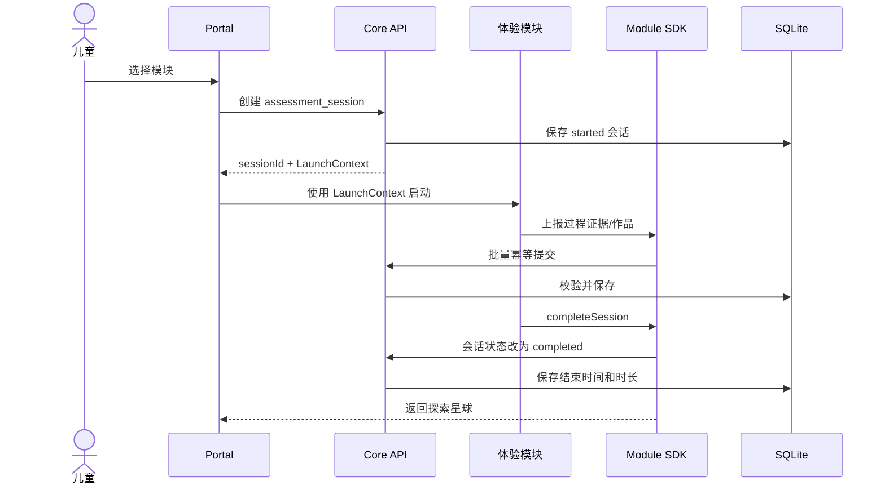
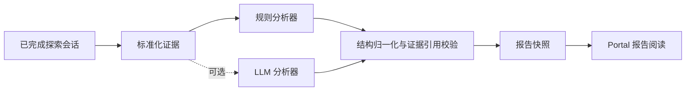
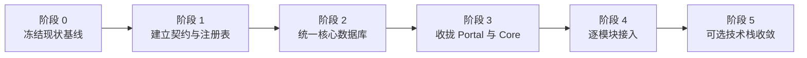

# AI 伯乐模块化评测平台架构重构设计

> 状态：已完成方案确认，等待项目负责人审阅本文档
>
> 日期：2026-08-29
>
> 范围：架构规划，不修改现有业务功能
> 适用规模：几十位学生、低并发、单机或局域网实验环境

## 1. 文档目的

本文档在保留现有功能的前提下，重新划分 AI 伯乐平台的系统边界、模块职责、数据所有权和扩展方式。重构目标不是把项目升级成复杂的企业级系统，而是让实验项目具备以下能力：

- 四个现有体验模块可以继续独立演化；
- 新模块可以通过注册和契约接入，而不是修改平台首页核心代码；
- 账号、探索会话、证据、作品索引和报告使用统一数据入口；
- 报告中的结论能够追溯到真实行为证据；
- 本地安装、启动、调试和数据迁移保持简单；
- React、Vue、原生 JavaScript 等不同技术栈可以在过渡期共存。

本文档也是后续实施计划、数据库迁移、模块接入和回归验收的基线。

## 2. 已确认的架构决策

| 编号 | 决策 | 原因 |
|---|---|---|
| ADR-01 | 采用“模块化单体核心 + 独立体验模块” | 兼顾清晰边界和现有功能保护，适合低并发实验项目 |
| ADR-02 | 不立即统一四个模块的前端技术栈 | 全量重写风险高，对当前研究目标贡献有限 |
| ADR-03 | Core API 是唯一跨模块数据入口 | 避免多个 Node/Python 进程直接读写同一数据库 |
| ADR-04 | 统一数据库继续使用 SQLite | 当前人数和并发量不需要 PostgreSQL 或分布式方案 |
| ADR-05 | 优先统一跨模块数据，模块内部数据渐进迁移 | 降低一次性迁移聊天、故事和职业任务数据的风险 |
| ADR-06 | 四个模块通过 Module SDK 和版本化契约接入 | 替换当前散落的固定端口、脚本注入和事件拼接 |
| ADR-07 | 报告从标准化证据生成，不直接读取模块内部数据库 | 保持报告可解释、可追溯并降低模块耦合 |
| ADR-08 | 不引入消息队列、容器编排或微服务治理 | 项目规模不需要这些基础设施 |

## 3. 当前架构基线

### 3.1 当前运行拓扑

当前一键启动配置包含 10 项本地服务：

| 服务 | 端口 | 技术 | 当前职责 |
|---|---:|---|---|
| 整合平台 | 4173 | Vinext、React、TypeScript | 登录页、探索星球、作品、足迹、报告入口 |
| 统一账号与证据中心 | 8020 | FastAPI、SQLite | 账号、Cookie 会话、证据事件、作品/足迹聚合 |
| 报告生成服务 | 8030 | FastAPI | 规则或 LLM 报告生成 |
| 聊天观察 | 3000 | Express、原生 HTML/JS | 对话、语音、手账、收藏、聊天分析 |
| 故事共创后端 | 8010 | FastAPI、SQLite | 故事、角色、观察、TTS、AI 服务 |
| 故事共创前端 | 5174 | React、Vite | 故事创建、游玩和作品展示 |
| 深海基地后端 | 8005 | FastAPI | 角色代理、评分和评估接口 |
| 深海基地前端 | 3001 | Vue、Vite | 三关游戏和关卡报告 |
| 职业模拟器 | 8000 | FastAPI、Jinja、原生 JS、SQLite | 职业情境、任务、记录和观察页 |
| 天赋报告 | 5175 | Vue、Vite | 报告书、雷达图和证据说明 |

平台通过 `app/config/modules.ts` 中的固定 URL 和端口打开四个模块。四个模块再加载 `http://localhost:8020/ai-bole-bridge.js`，通过全局 `window.AIBole` 获取账号和上报证据。



### 3.2 当前数据分布

| 数据 | 当前存储 | 当前所有者 | 问题 |
|---|---|---|---|
| 账号和登录会话 | `ai_bole_core.db` | platform-core | 与模块内部身份并未形成正式契约 |
| 跨模块证据事件 | `ai_bole_core.db` | platform-core | 事件结构偏通用，缺少正式评测会话实体 |
| 聊天历史、手账、收藏 | JSON/JSONL 文件 | chat | 单机 guest 设计与统一账号存在语义差异 |
| 故事、角色、消息、观察 | `story_cocreate.db` | story | 数据与统一账号仅通过上报事件间接关联 |
| 深海关卡状态 | 前端状态和后端评分结果 | deep-sea | 完整运行记录主要依赖浏览器上报 |
| 职业任务和会话 | `career_sim.db` | career | 内部会话和平台会话不是同一模型 |
| 报告 | 页面请求时生成 | talent-report/report-agent | 缺少统一的已发布报告快照和版本记录 |
| 作品与成长足迹 | 从证据事件推导 | platform-core | 聚合器依赖各模块不同的原始字段约定 |

### 3.3 当前功能清单

下列功能全部属于重构保护范围。

#### 平台功能

- 登录、注册、退出和儿童昵称/年龄档案；
- 探索星球与四模块入口；
- 我的作品；
- 成长足迹；
- 天赋报告入口和阅读；
- 浏览器前进、后退和模块返回平台；
- 示例数据与真实数据明确区分；
- 桌面、平板、手机和减少动态偏好支持。

#### 聊天观察

- 儿童与 AI 伙伴自由对话；
- 对话状态机、回复校验、修复和降级；
- 潜能画像分析；
- 历史对话、手账、每日发现和收藏；
- Vosk 离线语音输入；
- 对话完成证据上报。

#### 故事共创

- 创建角色、主题和故事；
- SSE 故事共创流程；
- 儿童输入安全处理；
- 儿童或故事导演完成结局；
- 故事作品、书架、观察和 TTS；
- 故事完成证据上报。

#### 深海基地

- 珊瑚生态配对；
- 洋流电网空间建构；
- 海洋议事厅协调任务；
- 角色互动、音效、语音和关卡反馈；
- 分关证据和完整通关证据上报；
- 失败暂存和重新同步提示。

#### 职业体验

- 职业选择和职业情境；
- 工作日任务和多阶段交互；
- 重试、提示、调整等过程记录；
- 职业探索历史与观察页面；
- 完成过程证据和体验快照上报。

### 3.4 当前主要问题与根因

| 表象 | 根因 | 后果 |
|---|---|---|
| 四模块被固定展示在一个统一页面 | 平台把模块清单、启动方式和 UI 写死在同一层 | 新增或替换模块需要修改平台代码 |
| 页面能跳转但模块没有真正统一 | 集成依赖固定端口、全局脚本和 Cookie | 本地环境变化会产生连锁故障 |
| 作品和足迹聚合逻辑复杂 | 没有统一探索会话和作品契约 | 聚合器需要猜测各模块字段含义 |
| 报告结论与模块内部分析并存 | 领域边界没有统一 | 同一行为可能被多套规则重复解释 |
| 数据库和 JSON 文件分散 | 每个模块从独立项目演进而来 | 账号关联、备份、迁移和实验数据导出困难 |
| 10 个服务依赖启动顺序 | 前后端和报告页面均独立运行 | 单机演示和故障定位成本较高 |
| 模块技术栈不一致 | 历史实现差异 | 公共能力难复用，但并非当前首要风险 |

## 4. 目标架构

### 4.1 总体结构


目标系统分为四个清晰层次：

1. **Portal**：统一用户体验，不承担模块内部业务；
2. **Core API**：统一账号、模块目录、探索会话、证据、作品和报告；
3. **Module SDK + Contracts**：定义所有模块共同遵守的接入协议；
4. **Experience Modules**：保留独立业务体验和内部实现。

Core API 是统一 SQLite 的唯一所有者。体验模块不能直接读取其他模块的数据，也不能直接读写统一数据库。

### 4.2 目标目录

```text
AI-platform-new/
├─ apps/
│  ├─ portal/                       # 统一平台外壳
│  └─ core-api/                     # 唯一跨模块后端
│     ├─ accounts/
│     ├─ catalog/
│     ├─ sessions/
│     ├─ evidence/
│     ├─ artifacts/
│     ├─ reports/
│     └─ database/
├─ experiences/
│  ├─ listening/
│  ├─ storytelling/
│  ├─ deep-sea-building/
│  └─ career-exploration/
├─ packages/
│  ├─ module-sdk/
│  ├─ contracts/
│  ├─ design-tokens/
│  └─ test-contracts/
├─ config/modules/
├─ scripts/
├─ docs/
└─ tests/
```

该目录是目标结构，不要求在第一阶段一次性移动全部文件。迁移期间通过兼容适配器维护现有路径。

### 4.3 组件职责

#### Portal

负责：

- 登录、注册和退出界面；
- 当前儿童档案；
- 从模块目录渲染探索入口；
- 创建探索会话并启动模块；
- 作品、足迹和报告阅读；
- 模块故障、数据空状态和重试提示。

不负责：

- 模块内部关卡和对话状态；
- 判定证据强弱；
- 拼接报告结论；
- 保存跨模块数据；
- 硬编码模块端口。

#### Core API

负责：

- 账号凭据和儿童档案；
- 模块注册、版本和适龄信息；
- 探索会话生命周期；
- 证据校验、幂等保存和查询；
- 作品元数据和快照索引；
- 报告生成、版本和证据引用；
- SQLite 数据库迁移、备份和实验数据导出。

#### Experience Module

负责：

- 自己的儿童交互、业务状态和内容安全；
- 生成可解释的模块原始行为；
- 通过 SDK 上报证据和作品；
- 正确结束、中断或退出探索会话；
- 提供模块健康状态和版本信息。

不负责：

- 识别统一账号 Cookie；
- 直接生成跨模块天赋结论；
- 查询其他模块数据；
- 直接写统一 SQLite；
- 决定平台作品、足迹和报告布局。

#### Module SDK

负责：

- 接收平台传入的启动上下文；
- 封装证据、作品和会话 API；
- 统一超时、重试、离线暂存和幂等键；
- 提供返回平台方法；
- 屏蔽模块内部框架差异。

## 5. 模块注册与契约

### 5.1 模块清单

平台不再维护固定的四模块数组。每个模块提供经过校验的清单：

```ts
interface ModuleManifest {
  id: string;
  version: string;
  name: string;
  description: string;
  entryUrl: string;
  healthUrl?: string;
  targetAge: { min: number; max: number };
  constructs: string[];
  capabilities: {
    resumable: boolean;
    producesArtifacts: boolean;
    requiresAI: boolean;
    supportsOfflineEvidence: boolean;
  };
}
```

当前四个模块以配置文件注册。配置由 Core API 读取，Portal 只消费 `/api/v1/modules` 返回的数据。

### 5.2 启动上下文

```ts
interface LaunchContext {
  accountId: string;
  childProfileId: string;
  sessionId: string;
  moduleId: string;
  moduleVersion: string;
  returnUrl: string;
  contractVersion: "1.0";
}
```

启动上下文不携带密码、Cookie 或其他模块数据。模块使用短期 `sessionId` 和 SDK 与 Core API 通信。

### 5.3 标准证据

```ts
interface EvidenceEventV1 {
  schemaVersion: "1.0";
  eventId: string;
  idempotencyKey: string;
  sessionId: string;
  moduleId: string;
  moduleVersion: string;
  eventType: string;
  occurredAt: string;
  evidenceLevel: "strong" | "reference";
  constructCandidates: string[];
  behaviorSummary: string;
  measures: Record<string, number | string | boolean | null>;
  context?: Record<string, string | number | boolean | null>;
}
```

约束：

- `behaviorSummary` 必须描述观察到的行为，不能直接给儿童贴标签；
- `constructCandidates` 只表示可能关联的观察维度，不是最终能力结论；
- `measures` 只能包含完成任务所需的最小化数据；
- 原始对话全文、敏感输入和无关点击流不得进入统一证据库；
- Core API 根据 `account_id + idempotency_key` 防止重复；
- 契约升级使用 `schemaVersion`，不直接破坏旧模块。

### 5.4 标准作品

```ts
interface ArtifactV1 {
  schemaVersion: "1.0";
  artifactId: string;
  sessionId: string;
  moduleId: string;
  type: "story" | "snapshot" | "conversation" | "game-result" | "other";
  title: string;
  summary: string;
  previewUrl?: string;
  sourceRef?: string;
  createdAt: string;
}
```

`artifacts` 保存跨模块作品索引，不要求第一阶段复制所有故事正文或对话正文。`sourceRef` 可以暂时指向模块内部记录；迁移后再替换为统一资源标识。

### 5.5 SDK 最小接口

```ts
interface AIBoleModuleSDK {
  initialize(): Promise<LaunchContext>;
  emitEvidence(event: Omit<EvidenceEventV1, "sessionId" | "moduleId" | "moduleVersion">): Promise<void>;
  publishArtifact(artifact: Omit<ArtifactV1, "sessionId" | "moduleId">): Promise<void>;
  completeSession(summary?: Record<string, unknown>): Promise<void>;
  interruptSession(reason: string): Promise<void>;
  returnToPortal(): void;
}
```

当前 `window.AIBole` 作为 V0 兼容入口保留一段迁移期，内部转发到新版 SDK。

## 6. 统一数据模型

### 6.1 数据所有权原则

1. Core API 独占统一数据库连接；
2. Portal 和体验模块只能通过 API 访问跨模块数据；
3. 模块内部运行数据可在迁移期保留原存储；
4. 所有跨模块记录必须关联 `child_profile_id` 和 `assessment_session_id`；
5. 报告保存生成时快照，不因后续规则变化静默改变；
6. 报告结论和证据通过显式关联表连接。

### 6.2 核心实体关系

```mermaid
erDiagram
    ACCOUNTS ||--|| CHILD_PROFILES : owns
    CHILD_PROFILES ||--o{ ASSESSMENT_SESSIONS : participates
    MODULE_DEFINITIONS ||--o{ ASSESSMENT_SESSIONS : runs
    ASSESSMENT_SESSIONS ||--o{ EVIDENCE_EVENTS : produces
    ASSESSMENT_SESSIONS ||--o{ ARTIFACTS : produces
    CHILD_PROFILES ||--o{ REPORTS : receives
    REPORTS ||--o{ REPORT_EVIDENCE_LINKS : cites
    EVIDENCE_EVENTS ||--o{ REPORT_EVIDENCE_LINKS : supports

    ACCOUNTS {
      text id PK
      text username UK
      text password_hash
      text password_salt
      text created_at
      text updated_at
    }
    CHILD_PROFILES {
      text id PK
      text account_id FK_UK
      text display_name
      integer age
      text created_at
      text updated_at
    }
    MODULE_DEFINITIONS {
      text id PK
      text version
      text manifest_json
      integer enabled
      text updated_at
    }
    ASSESSMENT_SESSIONS {
      text id PK
      text child_profile_id FK
      text module_id FK
      text module_version
      text status
      text started_at
      text ended_at
      integer active_seconds
    }
    EVIDENCE_EVENTS {
      text id PK
      text session_id FK
      text idempotency_key UK
      text event_type
      text evidence_level
      text constructs_json
      text behavior_summary
      text measures_json
      text occurred_at
    }
    ARTIFACTS {
      text id PK
      text session_id FK
      text type
      text title
      text summary
      text preview_url
      text source_ref
      text created_at
    }
    REPORTS {
      text id PK
      text child_profile_id FK
      text generator_version
      text status
      text report_json
      text generated_at
      text published_at
    }
    REPORT_EVIDENCE_LINKS {
      text report_id FK
      text evidence_event_id FK
      text section_key
    }
```

### 6.3 SQLite 配置

为适应多个本地请求但较低并发的场景，Core API 初始化数据库时统一设置：

- `PRAGMA foreign_keys = ON`；
- `PRAGMA journal_mode = WAL`；
- `PRAGMA busy_timeout = 5000`；
- 数据迁移按版本顺序执行；
- 启动前支持创建数据库备份；
- 不允许模块进程直接打开统一数据库文件。

### 6.4 模块内部存储的迁移边界

第一轮必须迁入统一数据库：

- 账号和儿童档案；
- 模块定义；
- 探索会话；
- 标准化证据；
- 作品索引；
- 报告快照和证据引用。

第一轮允许保留模块内部：

- 聊天全文、手账和收藏；
- 故事正文、消息、角色和内部观察；
- 深海临时关卡状态；
- 职业任务内部运行明细。

这些内部记录必须能够通过 `child_profile_id`、`assessment_session_id` 或明确的 `source_ref` 与统一数据关联。是否继续迁移，以后按实际维护成本决定。

## 7. API 边界

建议使用 `/api/v1` 作为新契约前缀，旧接口在迁移期继续可用。

| 方法 | 路径 | 用途 |
|---|---|---|
| `POST` | `/api/v1/auth/register` | 注册账号和儿童档案 |
| `POST` | `/api/v1/auth/session` | 创建登录会话 |
| `DELETE` | `/api/v1/auth/session` | 退出登录 |
| `GET` | `/api/v1/profiles/me` | 当前儿童档案 |
| `GET` | `/api/v1/modules` | 获取启用的模块目录 |
| `POST` | `/api/v1/assessment-sessions` | 创建探索会话 |
| `GET` | `/api/v1/assessment-sessions/{id}` | 查询会话和恢复信息 |
| `PATCH` | `/api/v1/assessment-sessions/{id}` | 完成、中断或恢复会话 |
| `POST` | `/api/v1/evidence-events:batch` | 幂等批量提交证据 |
| `POST` | `/api/v1/artifacts` | 发布作品索引 |
| `GET` | `/api/v1/artifacts` | 查询“我的作品” |
| `GET` | `/api/v1/timeline` | 查询成长足迹 |
| `POST` | `/api/v1/reports` | 生成并保存报告快照 |
| `GET` | `/api/v1/reports/latest` | 获取最近报告 |

错误返回统一包含：

```json
{
  "error": {
    "code": "EVIDENCE_SCHEMA_INVALID",
    "message": "这条探索记录格式不完整",
    "retryable": false,
    "requestId": "..."
  }
}
```

儿童界面只显示友好提示；技术错误码用于日志、测试和调试。

## 8. 关键业务流程

### 8.1 启动并完成一次体验



### 8.2 生成报告



无论规则路径还是 LLM 路径，输出必须经过同一归一化和证据引用校验。LLM 不可创建数据库中不存在的证据 ID。

## 9. 容错与降级

| 场景 | 处理方式 | 是否阻塞儿童体验 |
|---|---|---|
| Core API 暂时不可用 | SDK 保存最多 100 条本地队列，恢复后按幂等键补交 | 否 |
| 模块 AI 服务不可用 | 使用模块现有规则、固定回应或降级内容 | 原则上否 |
| 模块健康检查失败 | Portal 标记该模块暂不可用，并提供重试 | 只影响该模块 |
| 证据契约无效 | Core API 拒绝并记录原因，SDK 不无限重试 | 否 |
| 模块中途关闭 | 会话标记 `interrupted`；已有证据保留 | 否 |
| 报告生成失败 | 展示最近一次成功报告；允许重新生成 | 否 |
| 无真实数据 | 展示明确标记的示例或空状态 | 否 |
| 数据库迁移失败 | 停止 Core API 启动并保留迁移前备份 | 是，仅平台核心 |

不引入消息队列。浏览器本地队列和批量补交足以满足当前规模。

## 10. 部署与启动模型

### 10.1 迁移期

第一阶段保持现有 10 项服务可启动，新增服务配置校验和模块清单，不改变用户运行方式。

### 10.2 目标状态

在不重写模块业务的情况下，将服务数量从 10 项收敛到最多 6 项：

| 目标进程 | 合并内容 |
|---|---|
| Portal | 整合平台 + 天赋报告前端 |
| Core API | 账号中心 + 证据中心 + 报告服务 |
| 聊天观察 | 保留现有 Express 服务 |
| 故事共创 | FastAPI 提供 API 并托管前端构建产物 |
| 深海基地 | FastAPI 提供 API 并托管前端构建产物 |
| 职业体验 | 保留现有 FastAPI/Jinja 服务 |

一键启动脚本仍作为主要入口，但服务定义从单一配置读取。Portal 不再包含端口常量，只使用 Core API 返回的模块入口。

目标状态不要求 Docker、Nginx 或 Kubernetes。若以后需要局域网部署，再增加单一反向代理，不影响当前模块契约。

## 11. 新旧职责对照

| 当前实现 | 目标归属 | 处理方式 |
|---|---|---|
| `app/page.tsx` 中登录请求 | Portal + Core API/accounts | 保留界面，抽取 API 客户端 |
| `app/config/modules.ts` 固定模块数组 | Core API/catalog + `config/modules` | 改为注册表读取 |
| `PlanetHome` 直接 `location.href` | Portal 模块启动器 | 先创建会话，再打开模块 |
| `ai-bole-bridge.js` 全局脚本 | `packages/module-sdk` | 保留 V0 兼容层，逐模块迁移 |
| `platform-core/main.py` 多项职责 | Core API 内部业务模块 | 拆分文件但保留单进程 |
| `explorer_collection.py` 猜测模块字段 | sessions/artifacts 查询服务 | 改为读取标准会话和作品契约 |
| 独立 report-agent | Core API/reports | 合并为内部分析器 |
| 独立 talent-report 前端 | Portal/report | 保留视觉组件，迁入平台外壳 |
| 模块自行判断强/参考证据 | 模块规则 + Core 契约校验 | 模块产生初判，Core 验证结构和允许值 |
| 模块内部会话 ID | `assessment_session_id` | 建立映射并逐步替换 |

## 12. 原功能保留矩阵

| 功能 | 重构后入口 | 数据来源 | 验收方式 |
|---|---|---|---|
| 登录/注册/退出 | Portal | Core API/accounts | 原账号可迁移并正常登录 |
| 探索星球 | Portal | Core API/modules | 四模块顺序和文案保持，可动态增删 |
| 我的作品 | Portal | Core API/artifacts | 四模块各至少一类作品可回看 |
| 成长足迹 | Portal | Core API/sessions | 首次、最近、次数和时长口径稳定 |
| 天赋报告 | Portal | Core API/reports | 报告维度、建议和证据详情可查看 |
| 聊天对话 | listening | 模块内部 + Core 会话关联 | 完成一次对话并生成记录 |
| 聊天语音/手账/收藏 | listening | 模块内部 | 原功能回归通过 |
| 故事创建和共创 | storytelling | 模块内部 + Core 会话关联 | 完成故事并发布作品 |
| 故事安全/TTS/书架 | storytelling | 模块内部 | 原功能回归通过 |
| 深海三关 | deep-sea-building | 模块内部状态 | 三关均可完成 |
| 深海证据 | deep-sea-building | Core evidence | 三关和整轮证据不重复 |
| 职业选择和工作日 | career-exploration | 模块内部 | 至少完成一个职业流程 |
| 职业过程记录 | career-exploration | Core evidence | 调整、重试、提示等指标可追溯 |
| 示例数据 | Portal | Portal fixture | 始终明确标记为示例 |

## 13. 测试策略

### 13.1 契约测试

所有模块共享同一套测试：

- manifest 字段、版本、入口和适龄范围有效；
- 能接收合法 LaunchContext；
- 证据符合 V1 schema；
- 幂等提交不会创建重复事件；
- 完成、中断和返回平台状态正确；
- 模块无法连接 Core API 时能够暂存证据。

### 13.2 Core API 测试

- 账号之间的数据完全隔离；
- 探索会话状态迁移合法；
- 证据必须属于存在且匹配模块的会话；
- 作品必须关联合法会话；
- 报告只能引用真实证据；
- 旧账号和证据迁移后数量、所属和时间不变；
- SQLite 外键、WAL 和幂等索引生效。

### 13.3 最小端到端回归

1. 注册或登录测试账号；
2. 分别完成聊天、故事、深海和职业的最短有效路径；
3. 返回 Portal；
4. 在作品和足迹中看到对应记录；
5. 生成报告；
6. 从报告证据详情回溯到四模块的真实事件；
7. 退出并重新登录，确认数据仍存在且不串号。

## 14. 分阶段迁移计划



### 阶段 0：冻结现状基线

- 保存当前服务、端口、数据库和事件清单；
- 为四模块建立最小回归路径；
- 备份 `ai_bole_core.db`、`story_cocreate.db`、`career_sim.db` 和聊天数据目录；
- 固定现有功能保留矩阵；
- 不改变运行行为。

### 阶段 1：建立契约与模块注册表

- 定义 manifest、LaunchContext、EvidenceEventV1 和 ArtifactV1；
- 新建模块配置读取和校验；
- Portal 从模块目录渲染入口；
- 实现 SDK V1 和 V0 桥接适配器；
- 保持当前 10 项服务和模块路径不变。

### 阶段 2：统一核心数据库

- 增加 child_profiles、module_definitions、assessment_sessions、artifacts、reports 和关联表；
- 为现有 evidence_events 增加 session 归属和 schema 版本；
- 开启 WAL、外键和迁移版本；
- 编写可重复执行的数据迁移和回滚备份；
- Core API 成为唯一访问者。

### 阶段 3：收拢 Portal 与 Core

- 将天赋报告 Vue 页面迁入 Portal；
- 将 report-agent 合并为 Core API 内部 reports 模块；
- 将作品和成长足迹改为查询正式 sessions/artifacts；
- 消除 Portal 中的 `CORE_URL`、`REPORT_URL` 和固定端口常量；
- 将服务数逐步收敛。

### 阶段 4：逐模块接入

建议顺序：

1. **深海基地**：现有事件最完整，用作 SDK 样板；
2. **故事共创**：作品和会话关系清楚；
3. **职业体验**：迁移内部会话到平台会话映射；
4. **聊天观察**：内部数据类型最多，最后接入更稳妥。

每个模块独立完成：契约接入、数据关联、回归测试和旧桥接移除。任何时点都至少保留一条可工作的生产路径。

### 阶段 5：可选技术栈收敛

只有出现明确维护成本时再执行：

- 将原生页面逐步组件化；
- 统一 Vite 构建和前端包管理；
- 迁移模块内部持久化数据；
- 抽取真正复用的 UI 组件。

该阶段不属于完成本次架构重构的必要条件。

## 15. 数据迁移与兼容策略

- 所有迁移先复制数据库和聊天数据目录，不覆盖原文件；
- 迁移工具以旧数据只读、新数据库写入方式运行；
- 每张迁移表记录来源、旧 ID 和迁移时间；
- 迁移可重复执行，重复记录通过旧 ID 或幂等键跳过；
- 迁移后校验账号数、证据数、模块分布和时间范围；
- V0 API 在全部页面迁移前保留；
- 旧 `window.AIBole.emitEvidence` 转发到 V1 批量事件接口；
- 不在同一版本中同时删除旧接口和迁移最后一个调用者。

## 16. 风险与控制

| 风险 | 影响 | 控制方式 |
|---|---|---|
| 统一数据库迁移造成历史记录丢失 | 高 | 只读迁移、备份、数量校验和回滚演练 |
| 模块契约过度抽象 | 中 | V1 只包含当前四模块共同需要的最小字段 |
| 报告规则在迁移中改变 | 高 | 先保存旧输出样本，架构迁移不调整测评结论 |
| 浏览器离线队列串号 | 高 | 队列按 account + session 隔离，退出时停止补交 |
| 不同技术栈 SDK 行为不一致 | 中 | 使用共享契约测试，不强制共享框架代码 |
| 服务合并引入启动回归 | 中 | 每次只合并一项，并保留旧启动配置回退 |
| 模块内部 ID 与平台 ID 混淆 | 中 | LaunchContext 明确提供 sessionId，旧 ID 仅存 source_ref |

## 17. 非目标

本次架构重构明确不包含：

- 将所有模块重写为 React 或 Vue；
- 引入微服务、消息队列、Kubernetes 或服务网格；
- 为高并发进行分库分表或缓存集群设计；
- 在架构迁移中重新定义儿童天赋理论或评分规则；
- 一次性迁移全部聊天、故事和职业内部数据；
- 建立多学校、多租户或复杂教师权限体系；
- 对现有 UI 进行全面视觉重做。

## 18. 验收标准

### 架构验收

- 新模块通过新增 manifest 即可注册，Portal 不需要修改模块专用代码；
- Portal 不再硬编码四模块 URL 和端口；
- 所有跨模块数据只通过 Core API 访问；
- Core API 是统一 SQLite 的唯一访问者；
- 每条跨模块证据都关联儿童档案、探索会话和模块版本；
- 作品、足迹和报告读取统一模型；
- 报告结论能够引用真实存在的证据；
- 单个体验模块故障不会阻塞其他模块。

### 功能验收

- 原功能保留矩阵全部通过；
- 四模块各完成一次真实体验后，作品、足迹和报告均有对应记录；
- 离线暂存、幂等补交和重新登录不产生重复或串号；
- 示例内容不会被标记为真实儿童数据；
- 原有数据库和文件数据均有可验证迁移结果。

### 运维验收

- 一键安装、一键启动、状态检查和停止脚本仍然可用；
- 目标状态服务数量不超过 6 项；
- 服务入口和健康检查来自同一配置；
- 数据库可通过单一命令备份和校验；
- 开发者能够从文档定位任一模块的数据入口、会话和证据来源。

## 19. 后续文档

本文档通过评审后，应另行产出：

1. 逐任务实施计划；
2. Module Manifest 规范；
3. EvidenceEventV1 与 ArtifactV1 JSON Schema；
4. Core API OpenAPI 契约；
5. SQLite 迁移和回滚手册；
6. 四模块功能回归清单；
7. 实验数据导出与隐私说明。

实施计划必须按阶段拆分，每个阶段都能独立运行和验收，不允许以“全部重写完成后才能启动”为迁移方式。
